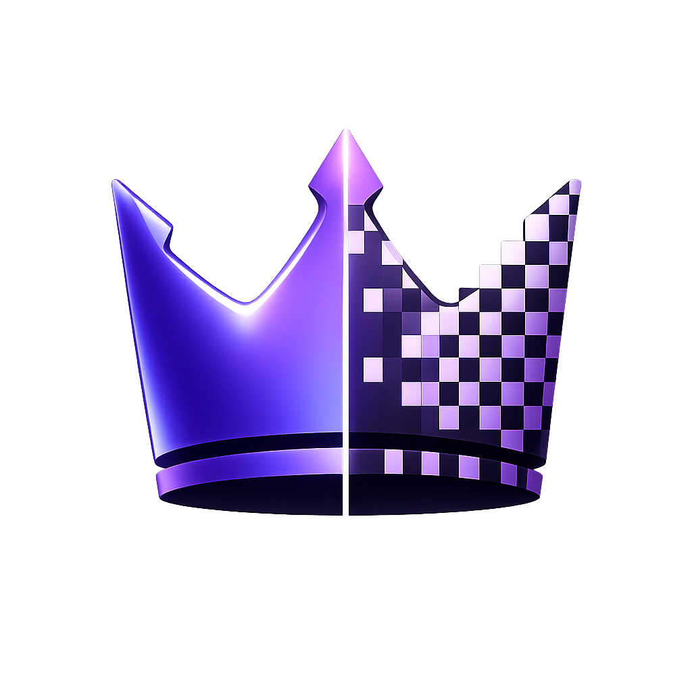

<h1 align="center">DitherBoss 🎨</h1>

<p align="center">
  
</p>


A browser-based dithering tool I built for converting images into stylized, pixel-perfect dithered art. No backend, no account, no install — just drop an image and start tweaking.

> v0.6.3 – still a work in progress but very usable already!

---

## What it does 🤔

- **B&W Mode** — classic black & white dithering with a bunch of algorithms (Floyd-Steinberg, Atkinson, Bayer matrices, Blue Noise, and more)
- **Color Mode** — reduces your image to a custom color palette using K-Means, Median Cut, Histogram, and a few other extraction methods
- **Live Preview** — everything updates in real time as you drag sliders
- **Export** — PNG, JPEG, and SVG trace output. You can export at the processing resolution or upscale back to the original (Pixel Fidelity toggle)
- **Batch Processing** — drop a `.zip` of images and get a `.zip` of dithered outputs back
- **Advanced Panel** — color swapping post-process, pixel distribution hover mask

---

## Getting started 🚀

```bash
npm install
npm run dev
```

Open `http://localhost:5173` and you should be good to go.

To build for production:

```bash
npm run build
```

Output goes into `dist/`.

---

## Tech stack 🛠️

- React + TypeScript
- Vite (fast dev server + bundler)
- Tailwind CSS
- Web Workers (all image processing runs off the main thread so the UI never freezes)
- ImageTracer.js (for SVG export)
- PiexifJS (for DPI injection in JPEG)
- JSZip + FileSaver (batch export)

---

## How it works ⚙️

The heavy lifting (dithering, color quantization, palette extraction) all runs inside a dedicated **Web Worker**, so the UI stays responsive even on large images. The main thread just manages state and renders the canvas.

Color matching uses an inline **Redmean color distance** formula which is way more perceptually accurate than basic Euclidean RGB distance, without needing a full LAB conversion on every pixel.

---

## Known quirks 🐛

- SVG batch export falls back to PNG (SVG tracing in a batch context is... complex)
- Very large images (4000px+) can still take a second or two on first load

---

## Author

Made by **Gostavo2003** 👾  
